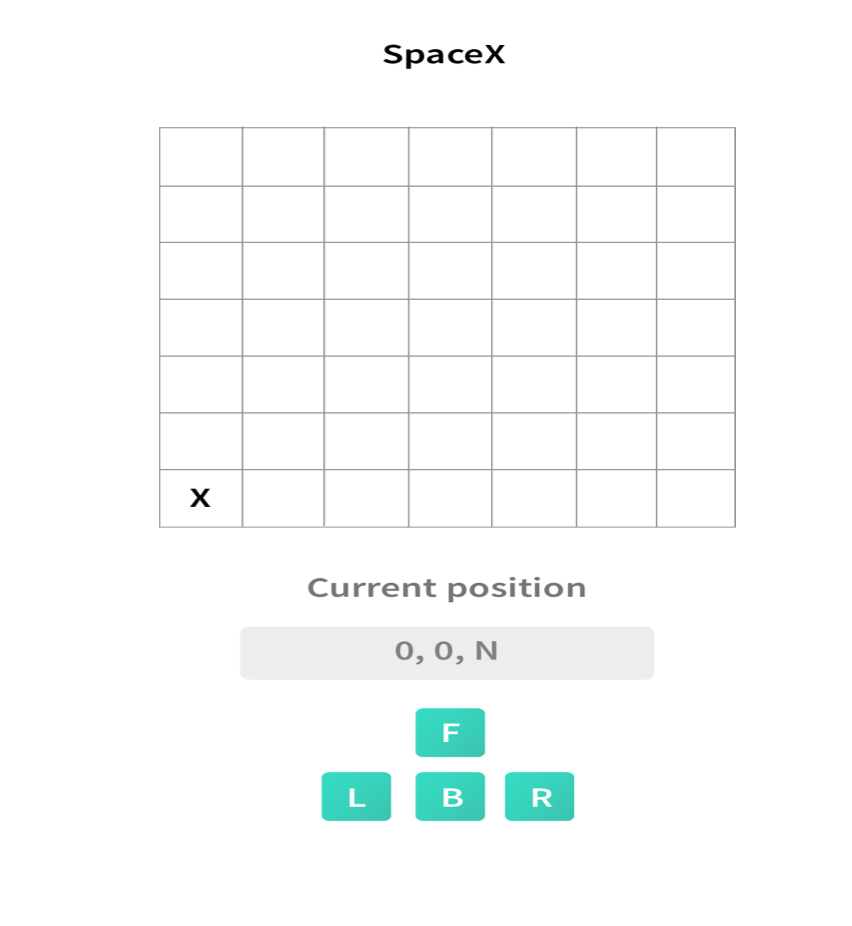

# Coding challenge Exercise 1: A spaceship to another dimension

After SpaceX’s New Horizon successfully flew past planet KF96, they now plan to land a controlled vehicle to further investigate the surface. You are responsible for developing an A UI that will allow the vehicle to move around the planet

To simplify navigation, the planet has been divided up into a grid. The vehicle’s position and location is represented by a combination of x and y coordinates and a letter representing one of the four cardinal compass points. An example position might be 0, 0, N, which means the vehicle is in the bottom left corner and facing North. Assume that the square directly North from (x, y) is (x, y+1)

#### In order to control a vehicle, SpaceX sends a simple string of letters. The only commands you can give the vehicle are ‘F’,’B’,’L’ and ‘R’

- Implement commands that move the vehicle forward/backward (‘F’,’B’). The vehicle may only move forward/backward by one grid point, and must maintain the same heading.
- Implement commands that turn the vehicle left/right (‘L’,’R’). These commands make the vehicle spin 90 degrees left or right respectively, without moving from its current spot.
- Implement wrapping from one edge of the grid to another. (The planet KF96 is a sphere after all) , example: if the vehicle in the position (0, 0, N) , which means the vehicle is in the bottom left corner and facing North, if it receive a commande (LF) , its new position will be on the other side of the planet which means the bottom left corner facing the west
  Implement obstacle detection before each move to a new square. If a given sequence of commands encounters an obstacle, the vehicle moves up to the last possible point and reports the obstacle.

## Here is an example

### Let's say that the vehicle is located at 0,0 facing North on a 100x100 grid

Given the command "FFRFF" would put the rover at 2,2 facing East.
You can take this design as an example.

